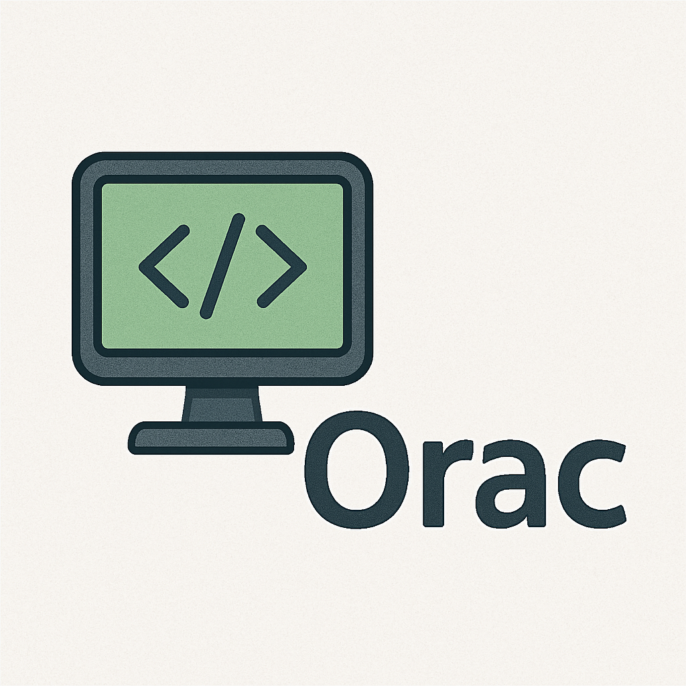

<p align="center">
  
</p>

<h1 align="center">Orac - Version 0.1.0</h1>

<p align="center">
  <em>Your retro-futuristic home AI assistant.</em>
</p>

<p align="center">
  <a href="https://github.com/Avalon60/orac">
    
  </a>
  <a href="LICENSE">
    
  </a>
  <a href="https://github.com/Avalon60/orac/actions">
    
  </a>
</p>

---

## ✨ Features (currently a roadmap)

- 🎤 **Voice-Driven AI**: Natural language interaction via satellite Raspberry Pi units.  
- 🧠 **Conversational Intelligence**: Integrated with LM Studio for cutting-edge AI responses.  
- 🏠 **Smart Hub Control**: Manage lights, media, and IoT devices seamlessly.  
- 🧩 **Home Assistant Integrations**: Works hand-in-hand with Home Assistant for extensive smart home control.  
- 💬 **Client Chatbot**: Interact with Orac through a web or desktop chatbot interface.  
- 🌐 **Supports Multiple LLM Services**: Connects to LM Studio, Ollama, OpenAI, and more.  
- 🛠 **Modular Design**: Easily extend Orac with custom skills and automations.  
- 🖥 **Cross-Platform**: Works with Linux Mint and other major platforms.  

---

## 📂 Quick Links

- [Installation](#-installation)
- [Oracle Free Setup](#-oracle-free-setup)
- [Usage](#-usage)
- [License](#-license)

---

## 📦 Installation

Clone the repository and install Orac in editable mode:

```bash
git clone https://github.com/Avalon60/orac.git
cd orac
pip install -e .
````

*(Add any additional setup instructions here)*

---

## 🛢 Oracle Free Setup

Orac uses an Oracle Database for configuration and metadata storage. To get started:

### Install Oracle Free (23ai)

Follow Oracle’s instructions to install **Oracle Database Free**:

* [Download Oracle Free](https://www.oracle.com/database/free/)
* [Oracle Free Documentation](https://docs.oracle.com/en/database/oracle/oracle-database/23/)

Alternatively, you can use a **Docker container** for local development:

```bash
docker run -d \
  -p 1521:1521 -p 5500:5500 \
  --name oracle-free \
  container-registry.oracle.com/database/free:23.5.0
```

* The default container uses:

  * **Username**: `system`
  * **Password**: `oracle`
  * **Service Name**: `FREEPDB1`

> ⚠️ *Change credentials for production use.*

---

### Create Orac User & Schema

Log in and create a dedicated user for Orac:

```sql
CREATE USER orac IDENTIFIED BY orac_password;
GRANT CONNECT, RESOURCE TO orac;
```

> ⚠️ Adjust roles/permissions as needed.

---

## 🛠 Usage

Start Orac with:

```bash
python -m orac
```

*(Describe how to configure Raspberry Pi satellites and connect to your home network.)*

---

## 📄 License

This project is licensed under the MIT License - see the [LICENSE](LICENSE) file for details.

---

## 🤖 About the Name

The name **Orac** pays homage to the iconic AI from *Blake’s 7*—a nod to retro science fiction with modern AI innovation.

---

<p align="center">
  <em>"Logic is a wreath of pretty flowers which smell bad."</em>
</p>
