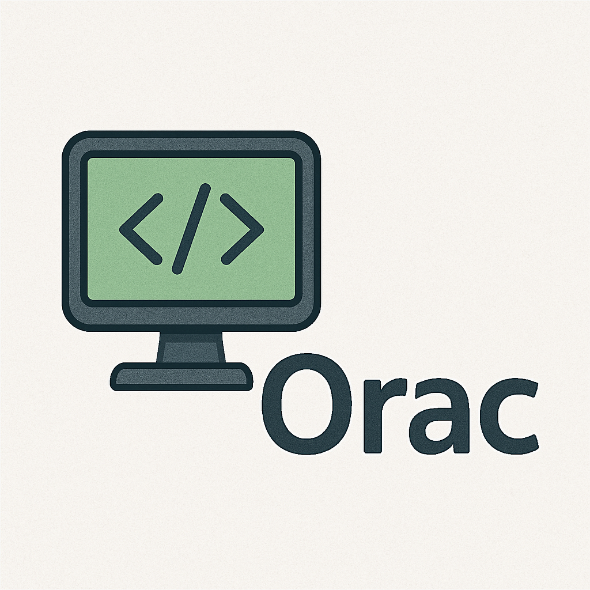

<p align="center">
  
</p>

<h1 align="center">Orac - Version 0.1.0</h1>

<p align="center">
  <em>Your retro-futuristic home AI assistant.</em>
</p>

<p align="center">
  <a href="https://github.com/Avalon60/orac">
    
  </a>
  <a href="LICENSE">
    
  </a>
  <a href="https://github.com/Avalon60/orac/actions">
    
  </a>
</p>

---

## ✨ Features (currently a roadmap)

- 🎤 **Voice-Driven AI**: Natural language interaction via satellite Raspberry Pi units.  
- 🧠 **Conversational Intelligence**: Integrated with LM Studio for cutting-edge AI responses.  
- 🏠 **Smart Hub Control**: Manage lights, media, and IoT devices seamlessly.  
- 🧩 **Home Assistant Integrations**: Works hand-in-hand with Home Assistant for extensive smart home control.  
- 💬 **Client Chatbot**: Interact with Orac through a web or desktop chatbot interface.  
- 🌐 **Supports Multiple LLM Services**: Connects to LM Studio, Ollama, OpenAI, and more.  
- 🛠 **Modular Design**: Easily extend Orac with custom skills and automations.  
- 🐧 **Linux Server Deployment**: The supported Orac server deployment path is Linux-based.  
- 🔑 **Administered via APEX Web Console**: User and configuration management through Oracle APEX at [http://localhost:8042/ords/orac/f?p=1042:LOGIN](http://localhost:8042/ords/orac/f?p=1042:LOGIN).  

---

## 📂 Quick Links

- [Installation](#-installation)
- [Prerequisites](#-prerequisites)
- [Oracle Free Setup](#-oracle-free-setup)
- [APEX Administration](#-apex-administration)
- [Usage](#-usage)
- [License](#-license)

---

## 📦 Installation

Clone the repository and install Orac in editable mode on the Linux machine that will host the Orac server:

```bash
git clone https://github.com/Avalon60/orac.git
cd orac
python3 -m venv .venv
source .venv/bin/activate
pip install -e .
```

The database deployment scripts expect to run from a Linux host with `bash`, `sudo`, and Docker available.

---

## 📋 Prerequisites

The current local-database deployment path is implemented by `bin/orac-db-deploy.sh`. That script assumes:

- A Linux host for the Orac server runtime.
- Docker Engine is installed.
- The Docker daemon is running.
- Docker Buildx is available, because the script builds the database image with `docker buildx bake`.
- `sudo` access is available, because the script creates and fixes ownership on the host persistence directory.
- Python 3.9+ is installed for the Orac utilities.
- A local checkout of this repository exists on the target machine.

The deployment script currently supports only:

- `TOPOLOGY=db-local`

If you are using a remote Oracle database topology, `bin/orac-db-deploy.sh` is not the correct setup path.

---

## 🛢 Oracle Free Setup

Orac uses an Oracle Database container for local configuration and metadata storage. The supported local setup path is:

1. Configure `resources/config/orac.env`.
2. Prepare a host directory for persistent Oracle data files.
3. Create or confirm the `orac` database credential entry.
4. Run `bin/orac-db-deploy.sh` to build and start the database container.

### Configure `resources/config/orac.env`

`bin/orac-db-deploy.sh` sources `resources/config/orac.env` before doing any work. At minimum, review these settings:

```bash
export CONTAINER_NAME=orac-db
export ORADATA_DIR=/u01/orac-db/oradata
export ORAC_IMAGE_NAME=orac
export ORAC_IMAGE_TAG=latest
export PORT_SQLNET=1521
export PORT_HTTP=8042
export PORT_EM=5500
export TOPOLOGY=db-local
```

Important points:

- `TOPOLOGY` must remain `db-local` for this script.
- `ORADATA_DIR` is the host directory mounted into the container at `/opt/oracle/oradata`.
- `PORT_HTTP` defaults to `8042` on the host, even though the container listens on `8080`.

### Prepare the persistent database location

By default, the database files persist under:

```bash
/u01/orac-db/oradata
```

You can change that location by editing `ORADATA_DIR` in `resources/config/orac.env`.

The deployment script will:

- Create the directory if it does not already exist.
- Run `sudo chown -R 54321:54321 "${ORADATA_DIR}"` so the Oracle container user can write to it.

On a clean machine, prepare the parent location before running the deploy script if your environment requires it. For example:

```bash
sudo mkdir -p /u01/orac-db/oradata
sudo chown -R 54321:54321 /u01/orac-db/oradata
```

Choose a location with enough free space for Oracle data files and one that you intend to keep across container rebuilds. If you delete the contents of `ORADATA_DIR`, the database state is lost.

### Configure Database Credentials

Orac stores database connection credentials securely using the `dbconn-mgr.sh` utility. Credentials are encrypted and stored in `~/.Orac/dsn_credentials.ini`.

**Required credential:** `orac`

Run the following command to create the database connection:

```bash
bin/dbconn-mgr.sh -c orac
```

You will be prompted for:
- **Username**: `ORAC`
- **Password**: Choose a password (this will be used for both `ORAC` and `ORAC_PLUGIN` database users)
- **DSN**: The database connection string (e.g., `localhost:1521/FREEPDB1`)
- **Wallet ZIP path**: Optional, press Enter to skip if not using Oracle wallet

> ⚠️ The password you enter here is used by the container setup scripts to create the `ORAC` and `ORAC_PLUGIN` database users automatically.

To list configured connections:
```bash
bin/dbconn-mgr.sh -l
```

To edit an existing connection:
```bash
bin/dbconn-mgr.sh -e orac
```

If the `orac` credential does not already exist, `bin/orac-db-deploy.sh` will attempt to initialize it for you by calling:

```bash
bin/dbconn-mgr.sh -c orac
```

### Build and start the Orac database container

Run:

```bash
bin/orac-db-deploy.sh
```

What the script does:

- Verifies that `resources/config/orac.env` exists.
- Verifies Docker is installed and the daemon is running.
- Ensures the persistent `ORADATA_DIR` exists and is owned by UID/GID `54321:54321`.
- Ensures the `orac` credential exists.
- Reads the Oracle password from the stored `orac` credential.
- Builds the local Orac database image with Docker Buildx.
- Starts the database container with these mappings:

```text
Host SQL*Net port  ${PORT_SQLNET} -> Container 1521
Host HTTP port     ${PORT_HTTP}   -> Container 8080
Host EM port       ${PORT_EM}     -> Container 5500
Host ORADATA_DIR   ${ORADATA_DIR} -> /opt/oracle/oradata
```

- Waits for the log marker `=  ORAC deployment complete =`.

Useful options:

```bash
bin/orac-db-deploy.sh --dry-run
bin/orac-db-deploy.sh --force
bin/orac-db-deploy.sh --force --no-cache
```

Notes:

- If a container with the configured name already exists, the script stops unless you pass `--force`.
- `--force` removes the existing container and deletes Oracle marker directories under `ORADATA_DIR` before rebuilding.
- The first build and deployment can take a significant amount of time. The script waits up to 30 minutes for completion.

---

## 🧭 APEX Administration

Orac’s user-management and configuration functions are handled through the **Orac Admin APEX application**, which provides a browser-based interface for maintaining users, skills, and system settings.

Once your Oracle Free / ORDS stack is running, open the Orac Admin app in a browser:

```
http://localhost:8042/ords/f?p=1042:LOGIN
```

This URL launches the **Orac Administration Application** login page.

### Default Workspace and Credentials

| Setting       | Value                  | Notes                                                       |
| ------------- | ---------------------- | ----------------------------------------------------------- |
| **Workspace** | `ORAC`                 | APEX workspace associated with the Orac schema.             |
| **Username**  | `ORAC_ADMIN`           | The initial administrative account.                         |
| **Password**  | *(set on first login)* | You’ll be prompted to choose a password at initial sign-in. |

After first login, you can use the APEX interface to manage user accounts, roles, permissions, and configuration data.

> 💡 *This application provides everyday administration of Orac — including user setup, role management, and configuration — with no command-line access required.*

> 🧰 *Developers who need to access the underlying APEX workspace can still do so via:*
> [http://localhost:8042/ords/r/apex/workspace-sign-in/oracle-apex-sign-in](http://localhost:8042/ords/r/apex/workspace-sign-in/oracle-apex-sign-in)

> 🌍 *If accessing from another machine or container, replace `localhost` in the URL with your host’s IP address or hostname (e.g., `http://192.168.0.42:8042/ords/f?p=1042:LOGIN`).*

---

### 🧩 Troubleshooting APEX Login

If you cannot access the Orac Admin application:

1. **Verify ORDS is running:**
   Check your container logs or terminal output — you should see a line like:

   ```
   INFO  ORDS has started and is listening on port 8042
   ```

2. **Check the URL:**
   Ensure the URL path ends with `f?p=1042:LOGIN` (not the developer workspace path).

3. **Confirm port mapping (Docker):**
   If running in a container, make sure port **8042** on the host maps to **8042** in the container:

   ```bash
   docker ps
   ```

   Look for `0.0.0.0:8042->8042/tcp`.

4. **Clear browser cache or use incognito mode:**
   Cached session tokens sometimes prevent APEX login pages from loading correctly.

5. **Reset ORAC_ADMIN password (if forgotten):**
   Connect via SQL*Plus or SQLcl:

   ```sql
   ALTER USER ORAC_ADMIN IDENTIFIED BY new_password;
   ```

6. **Check APEX version / installation:**
   If the login page still fails to load, confirm that APEX is properly installed and configured in the PDB:

   ```sql
   SELECT version FROM apex_release;
   ```

> 🧠 *Tip: If the APEX listener doesn’t respond, restart the ORDS service or your container — it usually resolves transient startup timing issues.*

---

## 🛠 Usage

Once the database container is up, start the Orac server on the Linux host with:

```bash
bin/orac.sh start
```

To inspect status or logs:

```bash
bin/orac.sh status
bin/orac.sh logs
```

---

## Checking the Install
If `bin/orac-db-deploy.sh` does not complete successfully, inspect the database container logs:

`docker logs orac-db`

To monitor the deployment while it is still running:

`docker logs --tail 200 -f orac-db`

## 📄 License

This project is licensed under the MIT License - see the [LICENSE](LICENSE) file for details.

---

## 🤖 About the Name

The name **Orac** pays homage to the iconic AI from *Blake’s 7*—a nod to retro science fiction with modern AI innovation.

---

<p align="center">
  <em>"Logic is a wreath of pretty flowers which smell bad."</em>
</p>
