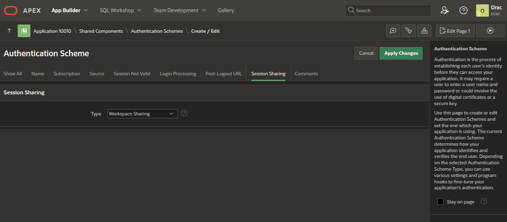

# Plugins

Orac plugins add optional capabilities without taking ownership of core
orchestration, routing, persistence, security, or context management.

## Source vs Installed Runtime

Orac uses two plugin filesystem locations with different jobs:

```text
plugins/<plugin-id>.json
plugins/<plugin-id>/
```

This is the bundled source tree. Edit plugin code, manifests, resources, APEX
exports, and database assets here. `bin/orac-plugin.sh package`,
`bin/orac-plugin.sh install --source`, and `bin/orac-plugin.sh install
--bundled` read from this tree.

```text
$ORAC_HOME/var/plugins/installed/<plugin-id>/<version>/
  manifest.json
  plugin/
  resources/
```

This is the activated runtime snapshot. The plugin registry records the active
snapshot in `installed_path`, and the normal Orac runtime loads enabled plugins
from that registry path. Runtime routing and service startup do not fall back to
the source tree when a registered installed snapshot is missing.

Use `bin/orac-plugin.sh check <plugin-id>` to validate the activated snapshot.
Treat `bin/orac-plugin.sh list` as inventory: it shows source-tree manifests,
registry state, and installed-artifact health. If a registry row says `success`
while `installed_path` is missing, `list` reports the artifact drift and
`check` fails for that plugin. Reinstall or quarantine the plugin state before
relying on that plugin's routing or services.

## Source Plugin Identity

A plugin is defined by matching filesystem artefacts:

```text
plugins/<plugin-id>.json
plugins/<plugin-id>/
```

The manifest filename stem, implementation directory, and manifest `plugin_id`
must match exactly. The source manifest is the source of truth for package and
source-tree discovery metadata; implementation code is not imported during
discovery. Normal Orac runtime loading uses the installed manifest recorded in
the plugin registry.

## Manifest Contract

Required manifest fields include:

- `schema_version`
- `plugin_id`
- `name`
- `description`
- `version`
- `enabled`
- `capabilities`
- `entitlements`
- `runtime`

Optional manifest fields currently supported by schema version 2 include:

- `entities`
- `examples`
- `entry_point`
- `execution`
- `routing`
- `configuration`
- `database`
- `secrets`
- `ui`
- `apex_apps`
- `python_dependencies`

Routing text is derived only from routing-semantic metadata. Runtime,
configuration, database, and execution-policy data do not become prompt or
routing text. Plugins produce route candidates; Orac core arbitrates whether
any candidate owns the current user turn.

Declarative route metadata may describe capability-level intents:

```json
"routing": {
  "interceptor": "interceptor:HomeAssistantDialogInterceptor",
  "capabilities": [
    {
      "id": "home_assistant.light_control",
      "description": "Control Home Assistant lights and lamps.",
      "intents": [
        {
          "name": "control_light",
          "examples": ["Turn on the lounge lamp."],
          "requires_confirmation": false,
          "safety_level": "local_mutation"
        }
      ]
    }
  ]
}
```

The route capability id must already appear in top-level `capabilities`.
`routing.interceptor` is optional and applies only to on-demand or hybrid
plugins. It points to a `PluginDialogInterceptor` subclass that reads immutable
dialogue matching metadata from the plugin's packaged `resources/` directory.

## Manifest JSON Reference

A minimal manifest looks like this:

```json
{
  "schema_version": 2,
  "plugin_id": "example",
  "name": "Example",
  "description": "Provides an example plugin capability.",
  "version": "1.0.0",
  "enabled": true,
  "capabilities": [
    "example.query"
  ],
  "entitlements": [],
  "runtime": {
    "mode": "on_demand"
  }
}
```

`plugin_id` must match both `plugins/<plugin-id>.json` and
`plugins/<plugin-id>/`. Capability names should be stable, namespaced strings.
Entitlements describe required platform permissions; they do not grant those
permissions by themselves.

Top-level `entities` and `examples` are optional routing hints. They may help
candidate discovery, but Orac core still arbitrates ownership and may fall back
to normal conversation.

`entry_point` declares an on-demand plugin implementation, for example:

```json
"entry_point": "plugin:ExamplePlugin"
```

Service plugins declare their service entry point under `runtime.service`.

## Dialogue Interception

Plugins may supply deterministic dialogue interception for routes declared in
the manifest. The manifest remains authoritative for executable routes; the
interception metadata is authoritative only for dialogue matching.

Package matching rules as an immutable resource:

```text
plugins/<plugin-id>/
  interceptor.py
  plugin.py
  resources/
    intercept_meta.json
```

A rule identifies one manifest route by `route_id`:

```json
{
  "rule_id": "weather_forecast",
  "route_id": "short_forecast",
  "match_type": "regex",
  "priority": 100,
  "patterns": ["^what is the forecast$"],
  "arguments": {
    "response_type": "forecast"
  }
}
```

`route_id` is the manifest intent name for the plugin and must be unique within
that plugin. During preparation, Orac validates every rule against
`routing.capabilities` and derives the selected `capability_id` and
`intent_name` from the manifest. Rules must not duplicate those manifest fields.

Interceptors subclass the core template and implement only
`build_arguments()`. Bundled plugins must not override the concrete
`intercept()` template method. Resource loading must use the Orac-bound
resource reader supplied to the interceptor; do not locate
`resources/intercept_meta.json` with `__file__` or module-path inference.

Matching evidence remains immutable through arbitration. When the router invokes
the selected plugin, it passes a mutable copy of the route arguments:

```python
meta["plugin_route"] = {
    "plugin_id": candidate.plugin_id,
    "capability_id": candidate.capability_id,
    "intent_name": candidate.intent_name,
    "arguments": dict(candidate.extracted_params or {}),
    "match_reasons": list(candidate.match_reasons),
}
```

Migrated plugins should dispatch from `meta["plugin_route"]` during normal
routing. Temporary `can_handle()` compatibility methods may remain for old
callers, but they must not create another candidate or run a separate ownership
parser.

Interception metadata and input are bounded. Metadata is limited to 64 KiB,
100 rules, bounded exact values and regex patterns, and bounded normalisation
replacements. User text longer than 2048 characters is not evaluated by plugin
regexes. Regexes must be anchored and cannot use backreferences, lookbehind, or
nested quantified groups. These checks run during plugin preparation; invalid
interception metadata disables that interceptor rather than bypassing plugin
discovery or execution policy.

Plugin knowledge scopes use canonical `PLUGIN:<plugin_id>` identities from the
same active runtime registry. A knowledge match is only a routing decision; it
does not invoke plugin code or grant plugin database access. Plugin execution
still passes through arbitration, entitlements, confirmation, audit, timeout,
redaction, and the managed invocation boundary.

## Plugin APEX Apps

Plugin APEX applications should be derived from the maintained scaffold export:

```text
resources/db/apex/orac_apps/f10042.sql
```

Copy the scaffold into the plugin package, then change the application id,
application alias, application name, card content, and any plugin-specific
pages. Keep the scaffold's cross-app return navigation, Page 0 return control,
application-level return preparation process, theme sync process, shared `ORAC`
workspace model, and default `ORAC_APX_PUB` parsing schema unless a reviewed
design explicitly requires otherwise.

Declare the derived export in the plugin manifest `apex_apps` section so the
plugin installer can import it, register the installed application id, and show
it through the Plugin Navigation app.

## Runtime Modes

| Mode | Meaning |
|---|---|
| `on_demand` | Loaded for routed requests. |
| `service` | Managed as a long-running plugin service. |
| `hybrid` | Provides both service and on-demand behavior. |

Only enabled `on_demand` and `hybrid` plugins with satisfied dependencies are
eligible for the routing index. Service registration is handled separately by
the plugin service manager. Successful plugin install creates service lifecycle
rows but does not start services; Orac startup starts services whose effective
policy is `auto`.

Long-running or scheduled services use the optional `runtime.service` object:

```json
"runtime": {
  "mode": "hybrid",
  "service": {
    "entry_point": "service:ExampleService",
    "execution_model": "long_running",
    "start_policy": "auto",
    "restart_policy": "on_failure",
    "shutdown_timeout_seconds": 10,
    "health_check": {
      "enabled": true,
      "method": "health",
      "interval_seconds": 30,
      "timeout_seconds": 5,
      "failure_threshold": 3
    }
  }
}
```

The first service registration uses the manifest `start_policy` as the initial
policy. Later manifest changes refresh the manifest policy while preserving an
operator override. Operators change startup policy through the Plugin Service
Status report in App 1043 or the CLI:

```bash
bin/orac-plugin.sh service policy <plugin_id> <service_code> <auto|manual|disabled>
```

`execution_model` is `long_running` or `scheduled`. Scheduled services may also
declare:

```json
"schedule": {
  "interval_seconds": 300,
  "run_on_start": true,
  "jitter_seconds": 30,
  "timeout_seconds": 60
}
```

## Configuration and Secrets

Bundled source plugins may provide a configuration template at:

```text
plugins/<plugin-id>/plugin.ini.example
```

The installer creates mutable local configuration at
`~/.Orac/plugin_config/<plugin-id>/plugin.ini` and never overwrites an existing
file during reinstall or upgrade.

Plugins access configuration through the scoped runtime/service context. They
must not read arbitrary configuration files or another plugin's settings.

Configuration keys are declared in the manifest:

```json
"configuration": {
  "required": [
    {
      "section": "example",
      "key": "host",
      "type": "string",
      "description": "External service host name."
    }
  ],
  "optional": [
    {
      "section": "example",
      "key": "enabled",
      "type": "bool",
      "description": "Whether optional behaviour is enabled."
    }
  ]
}
```

Supported configuration value types are `string`, `bool`, `int`, `float`,
`path`, and `list`.

Secrets belong in the encrypted PAT vault at `~/.Orac/pat_vault.ini` and must
be declared by the manifest:

```bash
bin/plugin-pat-mgr.sh --plugin home_assistant --set access_token
bin/plugin-pat-mgr.sh --plugin home_assistant --list-expected
bin/plugin-pat-mgr.sh --plugin home_assistant --check access_token
```

Secret metadata is declared as:

```json
"secrets": {
  "vault": "pat_vault",
  "default_key": "access_token",
  "allow_custom_keys": false,
  "keys": {
    "access_token": {
      "required": true,
      "description": "Long-lived API access token.",
      "setup_hint": "Create a token in the external system and store it with plugin-pat-mgr.sh.",
      "rotation_supported": true
    }
  }
}
```

Do not put secrets in `plugin.ini`, `orac.ini`, shell history, or command-line
arguments. Plugin runtime contexts expose secrets only within the owning plugin
scope.

Unresolved template placeholders make a plugin ineligible for deployment,
routing, and service startup.

## Execution Policy and Confirmation

The optional `execution` manifest object classifies plugin risk before code is
loaded. Supported action classes include informational reads, external reads,
local or external mutation, device control, and privileged system actions.

```json
"execution": {
  "action_type": "external_read",
  "requires_confirmation": false,
  "allowed_by_default": true,
  "capabilities": [
    "example.query"
  ],
  "entitlements": [
    "network.local_http"
  ],
  "scaffold": false,
  "notes": "Read-only external lookup."
}
```

Policy evaluates:

- action type
- required capabilities and entitlements
- whether confirmation is required
- whether execution is allowed by default
- scaffold/implementation status

Unknown or incompletely declared actions fail closed. Informational read-only
plugins may be allowed by default. Higher-risk actions require explicit policy
and, where declared, confirmation. See
[Plugin Execution Boundaries](agent-guardrails/55-plugin-execution-boundaries.md).

## Lifecycle and Services

Core runtime code owns discovery, dependency validation, service registration,
startup, shutdown, candidate discovery, arbitration, execution policy, and
provenance. Plugins receive scoped contexts for the resources they are
permitted to use.

Embeddings and vector similarity are optional shortlist/ranking signals only.
They must never directly execute a plugin. Ambiguous plugin matches must ask for
clarification, and install order, filesystem order, registration order, or
first-match-wins must never decide user intent.

Core-reserved commands cannot be intercepted by plugins. Explicit plugin
addressing restricts arbitration to the named plugin, but the named plugin must
still expose a matching declared capability.

Service and hybrid plugins must tolerate unavailable optional dependencies and
report failures without destabilising the core runtime. Plugin startup does not
grant authority to bypass confirmation, database, filesystem, network, or
context boundaries.

### Service Registration After Database Rebuilds

Plugin service status rows are runtime lifecycle state. They are stored in
`orac_core.plugin_services` and are registered by Orac during plugin routing
startup or refresh; plugin installation records the plugin metadata, but it
does not by itself guarantee that the service lifecycle table has been
repopulated after a database rebuild.

After a database rebuild or any operation that recreates core schema tables:

1. Apply the core database schema and APEX assets.
2. Install or reinstall the required plugins so the plugin registry and plugin
   APEX metadata are present.
3. Restart the Orac runtime, normally with `bin/orac-ctl.sh restart` for the
   managed stack or `bin/orac.sh restart` when controlling only the host AI
   engine.
4. Verify service registration from the approved status view:

   ```sql
   select service_id,
          effective_policy,
          current_state,
          lease_active_yn
     from orac_code.plugin_service_status_v
    order by service_id;
   ```

If the Plugin Apps operations page shows all service counts as zero after a
rebuild, first check whether `orac_code.plugin_service_status_v` is empty. An
empty status view with valid objects usually means Orac has not refreshed
plugin service discovery since the lifecycle table was recreated.

## Database Payloads

A plugin may declare owned database schemas and deployment assets. Plugin-owned
DDL remains under the plugin directory and is deployed through the approved
plugin database deployment path.

Database metadata is declared with the optional `database` object:

```json
"database": {
  "required": true,
  "on_missing": "warn_disable",
  "schemas": [
    {
      "schema_name": "orac_example",
      "purpose": "Stores example plugin shadow data and sync state.",
      "managed_by": "orac",
      "minimum_version": "1.0.0",
      "version_check": {
        "enabled": false
      },
      "backup": {
        "include": true,
        "export_mode": "schema"
      }
    }
  ]
}
```

`required` controls whether missing or failed plugin database deployment makes
the plugin ineligible. `on_missing` controls missing-schema behaviour and is one
of `warn_disable`, `warn_only`, or `fail_refresh`. Plugin schemas must be
managed by `orac`; plugin DDL must live under:

```text
plugins/<plugin-id>/db/schema/
```

Plugin database deployment status is recorded by Orac. Plugins must not run
their own setup DDL at ordinary runtime startup and must not write directly to
Orac core tables.

Plugins must not connect with core-schema owner credentials or bypass the
`orac_plugin` bridge. Runtime database access is restricted to declared,
approved APIs and grants. Database deployment status and audit data remain core
platform responsibilities.

Plugins may opt in to SQLcl Liquibase deployment for plugin-owned database
objects:

```json
"database": {
  "deployment": {
    "type": "liquibase",
    "controller": "db/liquibase/pluginController.xml"
  }
}
```

When omitted, `deployment.type` defaults to `sqlplus` and the existing plugin
database deployment path is used. Liquibase changelogs must remain plugin-local,
must use explicit includes, and must not include APEX exports. Each plugin
schema keeps its own Liquibase `databasechangelog` and
`databasechangeloglock` tables.

## UI and Status Surfaces

The optional `ui` object declares plugin-owned operational UI/status surfaces.
These are admin and diagnostic metadata, not voice/chat routing metadata:

```json
"ui": {
  "icon_class": "fa-plug",
  "status_provider": {
    "id": "example.status_summary",
    "description": "Aggregated plugin health and sync status.",
    "format": "plugin_status_v1",
    "redaction_required": true
  },
  "surfaces": [
    {
      "id": "example.admin_status",
      "type": "admin_status",
      "label": "Example Status",
      "description": "Shows plugin health and recent sync results.",
      "target": "apex",
      "audience": "admin",
      "required_roles": [
        "ORAC_ADMIN"
      ],
      "enabled": true,
      "apex": {
        "app_alias": "ORAC_EXAMPLE_STATUS",
        "app_export": "apex/example_status.sql",
        "entry_page_id": 1,
        "install_required": false
      }
    },
    {
      "id": "example.react_diagnostics",
      "type": "diagnostic_panel",
      "label": "Example Diagnostics",
      "target": "react",
      "audience": "admin",
      "enabled": true,
      "react": {
        "component": "ExampleDiagnosticsPanel",
        "status_endpoint": "example.status_summary",
        "install_required": false
      }
    }
  ]
}
```

Supported status provider format: `plugin_status_v1`.

Supported surface targets: `apex`, `react`.

Supported surface types: `admin_status`, `diagnostic_panel`.

Supported audiences: `admin`, `user`, `system`.

`redaction_required` defaults to true when omitted. Status output must not
expose access tokens, bearer headers, passwords, secrets, credential-bearing
URLs, or raw sensitive configuration values.

UI surface declarations do not create capabilities, do not enter prompt routing,
and do not grant access to plugin-private data.

### Plugin Icons

`ui.icon_class` is optional plugin identity metadata. It is intended for
navigation surfaces that represent the plugin or one of its applications, such
as the Plugin Navigation page in APEX application `1043`.

Use Font APEX icon names in one of these forms:

```json
"ui": {
  "icon_class": "fa-folder-open"
}
```

or:

```json
"ui": {
  "icon_class": "fa fa-folder-open"
}
```

Discovery normalises a single icon token such as `fa-folder-open` to
`fa fa-folder-open`. Already-normalised values such as `fa fa-folder-open` are
kept as-is. If a plugin does not supply an icon, Orac keeps the registry value
as `NULL` and applies the fallback `fa fa-plug` only at the approved
APEX/menu rendering boundary. This preserves the difference between "no icon
supplied" and "the plugin explicitly chose the plug icon."

Icon values are deliberately narrow for safety. The accepted form is only:

```text
fa fa-[a-z0-9-]+
```

Additional class tokens, HTML, JavaScript, URL-like syntax, quotes, angle
brackets, parentheses, semicolons, slashes, whitespace tricks, uppercase class
names, and arbitrary punctuation are rejected. For example, these values are
invalid:

```text
<span class='fa fa-plug'>
javascript:alert(1)
url(foo)
fa fa-plug extra-class
fa fa-plug; color:red
fa / fa-plug
```

`ui.icon_class` is never an operational status icon. Aggregate operational
dashboard cards must use fixed operational icons chosen by the dashboard, such
as `fa fa-play`, `fa fa-list`, `fa fa-stop`,
`fa fa-exclamation-triangle`, `fa fa-ban`, `fa fa-sliders`, or `fa fa-key`.
Plugin manifest icons must not influence operational dashboard SQL, card icon
expressions, CSS classes, conditional rendering, or layout decisions.

`ui.accent_class` is reserved nullable metadata. It is validated only against a
fixed safe allowlist when configured and is not rendered by APEX navigation
surfaces unless a fixed safe Universal Theme colour mechanism is explicitly
used. Do not rely on arbitrary `u-*` class names being accepted.

## Plugin-Supplied APEX Apps

Plugin packages may declare installable APEX application exports in the
dedicated `apex_apps` section. This is installation lifecycle metadata only; it
is separate from conversational capabilities and from `ui.surfaces`.

```json
"apex_apps": [
  {
    "app_alias": "ORAC_EXAMPLE_STATUS",
    "label": "Example Status",
    "description": "Admin status application for the Example plugin.",
    "app_export": "apex/example_status.sql",
    "workspace": "ORAC",
    "parsing_schema": "ORAC_APX_PUB",
    "application_id": 1043,
    "entry_page_id": 1,
    "install_required": true,
    "replace_existing": false,
    "required_roles": [
      "ORAC_ADMIN"
    ],
    "icon_class": "fa-plug",
    "card_title": "Example",
    "card_subtitle": "Plugin health and sync status",
    "enabled": true
  }
]
```

`app_alias` is the stable logical key for the app. `application_id` is optional
and should be used when the export expects a specific APEX application id.
`parsing_schema` defaults to `ORAC_APX_PUB`. `icon_class` is the preferred
app-level icon field. The legacy `icon` field remains supported for older
manifests, but new manifests should use `icon_class`.

The effective navigation icon for a plugin-supplied APEX app is resolved in
this order:

1. `apex_apps[].icon_class`
2. legacy `apex_apps[].icon`
3. plugin-level `ui.icon_class`
4. the approved view/rendering fallback `fa fa-plug`

App-level icon metadata is useful when a plugin has multiple APEX apps and each
app needs a distinct navigation identity. App-level icon values use the same
safe Font APEX validation and normalisation rules as `ui.icon_class`. If both
`apex_apps[].icon_class` and legacy `apex_apps[].icon` are supplied,
`icon_class` wins.

Plugin-supplied APEX applications must target the shared Orac workspace,
`ORAC`; plugin menu links and app-to-app navigation rely on a common workspace
session context and do not support arbitrary plugin workspaces.

Plugin-supplied APEX applications must also configure their authentication
scheme with **Session Sharing** set to **Workspace Sharing**. This is required
for seamless navigation from the Orac plugin app hub into plugin apps without a
second login prompt.



To verify or change the setting in APEX Builder, open the plugin application,
go to **Shared Components** >
[**Authentication Schemes**](http://localhost:8042/ords/r/apex/app-builder/authentication-schemes?session=16421612331627),
open the active authentication scheme, expand **Session Sharing**, and set
**Type** to **Workspace Sharing**.

Plugin APEX apps that are launched from the Orac administration plugin hub
should also support theme inheritance. The hub passes the request marker
`ORAC_THEME_SYNC` when it opens the Plugin Apps launcher, and the launcher
passes the same marker onward when it opens installed plugin apps. A plugin app
that receives this marker should align its current Universal Theme style with
application `1042` by matching the active style name.

Add a Before Header PL/SQL process, normally on the plugin app entry page, with
this pattern:

```sql
declare
  l_theme_style_name  apex_application_theme_styles.name%type;
  l_theme_number      apex_application_themes.theme_number%type;
  l_target_style_name apex_application_theme_styles.name%type;
begin
  if :REQUEST = 'ORAC_THEME_SYNC' then
    select t.theme_number
      into l_theme_number
      from apex_application_themes t
     where t.application_id = :APP_ID
       and t.is_current     = 'Yes';

    select s.name
      into l_theme_style_name
      from apex_application_theme_styles s,
           apex_application_themes t
     where s.application_id = t.application_id
       and s.theme_number   = t.theme_number
       and s.application_id = 1042
       and t.is_current     = 'Yes'
       and s.is_current     = 'Yes';

    select s.name
      into l_target_style_name
      from apex_application_theme_styles s
     where s.application_id = :APP_ID
       and s.theme_number   = l_theme_number
       and s.name           = l_theme_style_name;

    apex_theme.set_session_style(
      p_application_id => :APP_ID,
      p_theme_number   => l_theme_number,
      p_name           => l_target_style_name
    );
  end if;
exception
  when no_data_found then
    null;
end;
```

The process sets the matching style for the current session only. It explicitly
checks that the target application contains the hub style name before calling
`apex_theme.set_session_style`, and remains tolerant of missing style names so
plugin apps continue to open if the local export does not include a match.
Plugin app links do not need to assemble this marker themselves when they are
listed through `orac_code.plugin_apex_app_menu_visible_v`; that approved view
prepares the launch URL and includes `ORAC_THEME_SYNC` for the installed app.

When `install_required` is true, the plugin installer validates that
`app_export` exists inside the plugin package and imports the export. Import
output is captured in the plugin APEX app registry. The installed APEX
application id is recorded after import for future menu surfaces.

Phase 1 idempotency is fail-safe: an existing app alias is reused as an
installed app record and is not replaced unless `replace_existing` is
explicitly true. Required APEX app import failure makes the plugin installation
fail; Orac does not silently mark the plugin successful when its required admin
app failed to import.

Disabled, failed, and metadata-only APEX app rows are hidden from plugin app
listing queries.

## Audit and Provenance

Plugin-handled responses include provenance describing the plugin, capability,
action classification, and policy result. Invocation and audit persistence are
described in:

- [Plugin Audit Persistence](plugin-audit-persistence.md)
- [Plugin Audit Database/API Design](plugin-audit-db-api-design.md)

## Plugin Layout

Minimal layout:

```text
plugins/
  <plugin-id>.json
  <plugin-id>/
    README.md
    plugin.py
```

Add `resources/`, `db/schema/`, and plugin-local tests only when the plugin
requires them. Use `resources/intercept_meta.json` for dialogue matching rules
when the manifest declares `routing.interceptor`. Use `plugins/_template/` as
the implementation starting point.

## Packaging And Installation

Plugins may be distributed as validated `.tar.gz` archives:

```text
manifest.json
plugin/
  plugin.py
  plugin.ini.example
  resources/
    intercept_meta.json
  apex/
    example_status.sql
  db/schema/
requirements.txt
README.md
```

Only `manifest.json` and `plugin/` are mandatory. The manifest is authoritative;
`requirements.txt`, when present, is a human-readable mirror and must match the
manifest dependency declarations. APEX exports declared by `apex_apps` must be
inside the plugin package, commonly under `plugin/apex/`.

```bash
bin/orac-plugin.sh package --source plugins/home_assistant --output dist/
bin/orac-plugin.sh install dist/orac-plugin-home_assistant-1.0.0.tar.gz
bin/orac-plugin.sh install --source plugins/home_assistant
bin/orac-plugin.sh install --bundled home_assistant
bin/orac-plugin.sh install --all
bin/orac-plugin.sh status home_assistant
bin/orac-plugin.sh check home_assistant
```

Installed runtime snapshots live under `$ORAC_HOME/var/plugins/installed`.
Mutable configuration lives under `~/.Orac/plugin_config/<plugin-id>/plugin.ini`,
and encrypted secrets remain in `~/.Orac/pat_vault.ini`.

## Python Dependencies

Plugins declare their direct third-party dependencies in the manifest:

```json
"python_dependencies": [
  "requests>=2.32,<3"
]
```

The installer validates requirement syntax, rejects URLs, direct references,
local paths and pip options, installs into the active Orac environment using
`python -m pip`, and runs `python -m pip check`. Standard-library and Orac-owned
imports are not declared. Plugins must declare direct third-party imports even
when Orac core already supplies the package.

Installation validates configuration, required PAT-vault entries, dependencies,
database deployment and entry-point readiness. It does not start long-running
services or contact plugin external APIs. Only a successfully registered and
enabled installation is eligible for routing or service startup.

Repository-level implementation standards remain in
[`docs/agent-guardrails/50-plugin-standards.md`](agent-guardrails/50-plugin-standards.md).

## Supplementary Documentation

Documentation outside a plugin's `plugins/<plugin-name>/README.md` should be
located in its `plugins/<plugin-name>/docs/` directory.

The plugin README should link to its supplementary documents.
